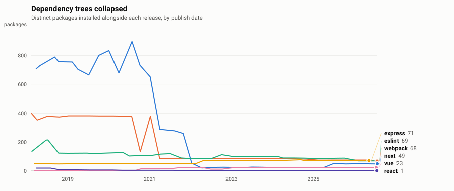
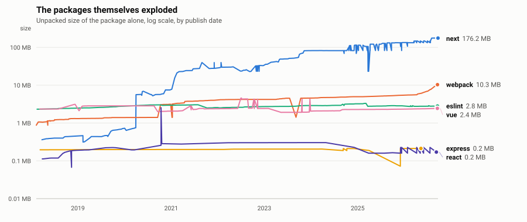

# The Great Consolidation

Everyone knows the JavaScript ecosystem got more bloated. The data says something
stranger happened.

Dependency trees have been collapsing for years. The packages at the top of those
trees have been growing enormous. Both trends are large, both are recent, and the
second one is not what people are measuring when they complain about
`node_modules`.

<!-- generated:headline -->
Since 2018-03, installing `next` went from pulling in **707 packages to 49**, a 93% drop. Over the same period `next` itself grew **411x**, from 0.4 MB to 148.2 MB across 8,094 files.
<!-- /generated:headline -->

<picture>
  <source media="(prefers-color-scheme: dark)" srcset="charts/trees-dark.svg">
  <source media="(prefers-color-scheme: light)" srcset="charts/trees-light.svg">
  
</picture>

<picture>
  <source media="(prefers-color-scheme: dark)" srcset="charts/sizes-dark.svg">
  <source media="(prefers-color-scheme: light)" srcset="charts/sizes-light.svg">
  
</picture>

<!-- generated:table -->
| package | first seen | packages installed | package size | files |
| --- | --- | ---: | ---: | ---: |
| `next` | 2018-03 | 707 → **49** | 0.4 MB → **148.2 MB** | 72 → **8,094** |
| `webpack` | 2018-02 | 400 → **68** | 0.9 MB → **7.7 MB** | 282 → **776** |
| `eslint` | 2018-02 | 135 → **69** | 2.3 MB → **2.8 MB** | 356 → **420** |
| `express` | 2018-03 | 50 → **71** | 0.2 MB → **0.2 MB** | 16 → **16** |
| `vue` | 2018-03 | 1 → **23** | 2.3 MB → **2.4 MB** | 213 → **37** |
| `react` | 2018-03 | 19 → **1** | 0.1 MB → **0.2 MB** | 8 → **27** |
<!-- /generated:table -->

## What is going on

After the `left-pad` incident in 2016, depending on hundreds of small packages
maintained by strangers stopped looking like elegant modularity and started
looking like a liability. The ecosystem responded, but not by writing less code.
It responded by moving that code inside fewer packages.

Bundling a dependency into your own tarball removes it from the dependency graph.
The graph gets shorter. The install does not get smaller. The audit surface does
not really shrink either, it just stops being enumerable by tools that count
packages.

So the metric everyone watches improved, and the thing that metric was a proxy for
did not.

None of this makes consolidation the wrong call. Fewer independently published,
independently compromisable packages in a build is a real security gain. The point
is narrower: package count alone stopped describing what you install, and most
tooling still reports it as though it does.

## Method

Two public sources, no scraping, no browser automation.

**[npm registry](https://registry.npmjs.org)** returns a package's full publish
history in one request. Since npm 5.6, every release records `unpackedSize` and
`fileCount`, so the on-disk footprint of any version is a matter of record rather
than something to be measured after the fact.

**[deps.dev](https://deps.dev)** (Google's Open Source Insights) resolves a
dependency graph for any version, including old ones. Counting its nodes gives the
number of distinct packages an install pulls in.

Because both sources are historical, this repository did not have to wait a year
to have something to show. The first commit carried eight years of measurements.
The daily job only extends the right-hand edge.

<!-- generated:stats -->
`17,867` releases measured across `83` packages, `2,121` with a resolved dependency graph. Last collected `2026-08-24`.
<!-- /generated:stats -->

Dependency graphs are sampled at one release per package per quarter. Resolving
every version would mean tens of thousands of requests for a line that would look
identical. Releases outside the sample keep an empty `tree_size` rather than an
interpolated one.

## Caveats

Read these before quoting any number here.

**deps.dev resolution is not your lockfile.** It is a consistent resolver applied
uniformly across time, which is what a trend needs, but npm, pnpm and yarn can and
do produce different trees. Treat the counts as comparable to each other, not as a
prediction of your own install.

**`unpackedSize` is the published tarball, not your disk.** It excludes
dependencies, and it does not account for the fact that platform-specific binaries
often mean you install one of several optional packages rather than all of them.
Next.js is the clearest case: much of its size is prebuilt native binaries.

**Some jumps are packaging changes, not real growth.** TypeScript reports 34.7 MB
in early 2018 and 2.4 MB today. Nothing shrank by a factor of fourteen. The layout
of what gets published changed. Per-package anomalies deserve a look at the release
notes before being read as a trend.

**The sample is popular packages, picked for recognisability,** not drawn at random
from the registry. It shows what happened to the tools most people actually
install. It is not a census of npm, and it is biased toward packages that survived
long enough to have eight years of history.

**Prereleases are excluded entirely.** Any version containing a hyphen is dropped,
per semver. This matters more than it sounds: React publishes its experimental
channel continuously as `0.0.0-<commit sha>`, and Astro and Rollup do similar. An
earlier version of this collector filtered only on known channel names such as
`canary` and `beta`, which let 719 of those builds into the dataset and ten of them
into the published charts.

## Data

Both files are plain CSV, regenerated in full on every run so diffs stay readable.

`data/releases.csv` is one row per published version: publish date, unpacked size,
file count, direct dependency count, and resolved tree size where sampled. Rows are
immutable once written.

`data/daily.csv` is one row per package per day: whatever the latest version was
that day. This is the file that grows when the ecosystem is quiet.

## Running it

Python 3.9 or newer. No dependencies, standard library only.

```sh
python3 backfill.py          # one-time history pull, about a minute
python3 collect.py           # today's snapshot, what the daily job runs
python3 render.py            # redraw charts, refresh this README
python3 -m unittest discover tests -v
```

Add or remove packages in `packages.json`, then run `backfill.py <name>` to fill in
history for the new ones.

A GitHub Actions workflow runs `collect.py` and `render.py` daily and commits the
result. It sets the commit author explicitly, because commits attributed to
`github-actions[bot]` do not appear on a contribution graph.

## Licence

Code under MIT. The datasets in `data/` are released under
[CC0](https://creativecommons.org/publicdomain/zero/1.0/): use them for anything,
no attribution required, though a link back is welcome.
